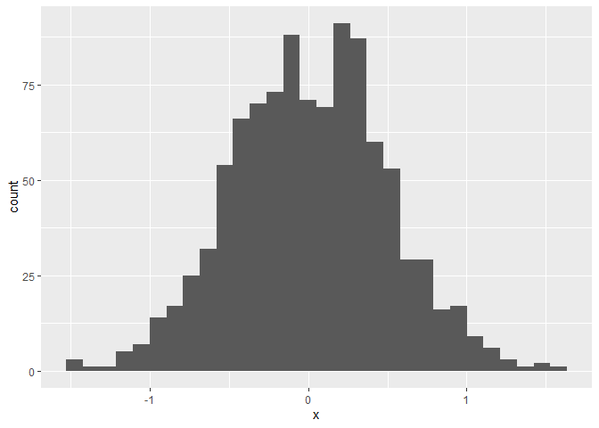
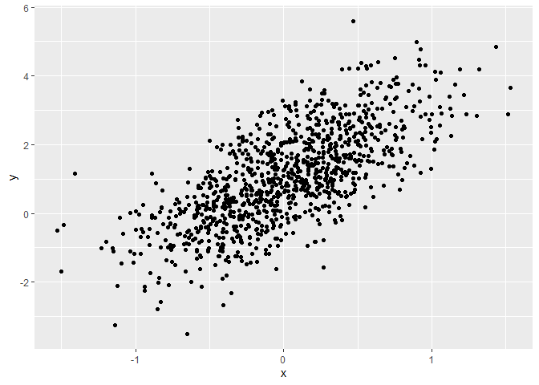
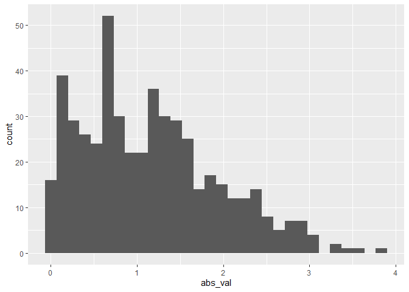

Simple document
================
You Wu
2023-09-12

I’m an R Markdown document!

# Section 1

Here’s a **code chunk** that samples from a *normal distribution*:

``` r
samp = rnorm(100)
length(samp)
```

    ## [1] 100

# Section 2

This code is borrowed from last lecture; it creates a dataframe for
plotting.

``` r
plot_df=
  tibble(
    x=rnorm(1000,sd=0.5),
    y=1+2*x+rnorm(1000)
  )
```

Next up i a histogram of the `x` variable in `plot_df`

``` r
ggplot(plot_df,aes(x=x))+geom_histogram()
```

    ## `stat_bin()` using `bins = 30`. Pick better value with `binwidth`.

<!-- -->

Lastly, I’ll do a scatterplot.

``` r
ggplot(plot_df,aes(x=x,y=y))+geom_point()
```

<!-- -->

# Section 3: Learning assesment!

The chunk below creates a dataframe containing a sample of size 500 from
a random normal variable with mean equals to 1, constructs the specified
logical vector, takes the absolute value of each element of that
sample,and produces a histogram of the absolute value. The code chunk
also finds the median of the sample and stores it for easy in-line
printing.

``` r
la_df=
  tibble(
    num_samp=rnorm(500,mean=1),
    log_vecc=num_samp>0,
    abs_val=abs(num_samp)
  )
ggplot(la_df,aes(x=abs_val))+geom_histogram()
```

    ## `stat_bin()` using `bins = 30`. Pick better value with `binwidth`.

<!-- -->

# Section 4:

I can take the mean of the sample, too! The mean is -0.0543.
